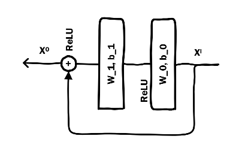

# 1.Introduction

- 输入：可以是dense也可以是sparse。
- combinatorial features/cross features/multi-way features很重要，但是需要人工设计。

# 2.Related Work

- Neocognitron network（1980s）：部分连通结构保证了平移不变性。
- CNN发展很猛，超过了sift特征：深度学习可以超越专家手动设计特征。
- DSSM：学习字符串之间的语义相似性，每个字符串由一个tri-letter grams稀疏表示，最终通过余弦距离计算相似度。
- FM：dense特征表现差。

# 3.SPONSORED SEARCH

- 广告系统
- keyword：
  - Query
  - Keyword：广告主买的词，来匹配用户的query。
  - Title：广告标题
  - Landing page：落地页，点击广告后跳到的页面。
  - Match type：精准、短语、上下文
  - Campaign：广告主在一段明确的期间里(如一年)，推出一系列拥有共同主题或讯息的广告，以期建立广告讯息的累积效果，塑造品牌与企业一致的形象，并给予目标受众持续而深刻的刺激与冲击。
  - Impression：一个ad被展示给一个user。
  - Click
  - Click through rate
  - Click Prediction

# 4.特征表示

## 4.1独立特征

- 离散特征可以离散为onhot后取数量最多的，去除其余的。
- count

## 4.2组合特征

- onehot
- count

# 5.模型结构

- 输入只有独立特征
- 损失函数：logloss、softmax

## 5.1Embedding Layer

- 当embedding维度小于特征数，embedding被用来减少输入特征的维度。本文低于256维的跳过embedding层，直接concate进embedding的输出，embedding层的输入+低维变量，合并为k维特征进入stacking层。
- embedding的维度对模型大小有很大影响。

## 5.2Stacking Layers

- embedding出来后加上偏置b后接ReLU激活，然后concate起来。

## 5.3Residual Layers

- Residual layer用来拟合残差，有numerical advantage。

## 5.4Early Crossing VS Late Crossing

- 在DeepCrossing中，特征是在Embedding之后就开始进行交叉，但是有一些模型如DSSM，是在各类特征单独处理完成之后再进行交叉计算
  - DSSM延迟特征交互（crossing），在前向传播的后面执行特征交互。
  - Deep Crossing开始就特征交互，更好。

# 6.实现

- CNTK

- 4张k40

# 7.实验

- 神经元：256、512、512、256、128、64

## 7.1表现

- 一对文本输入任务（CP1）：logloss DSSM VS Deep Crossing，Deep Crossing更好。
- CP2：Deep Crossing更好

## 7.2Beyond Text Input

## 7.3Comparison with Production Models

# 8.结论

