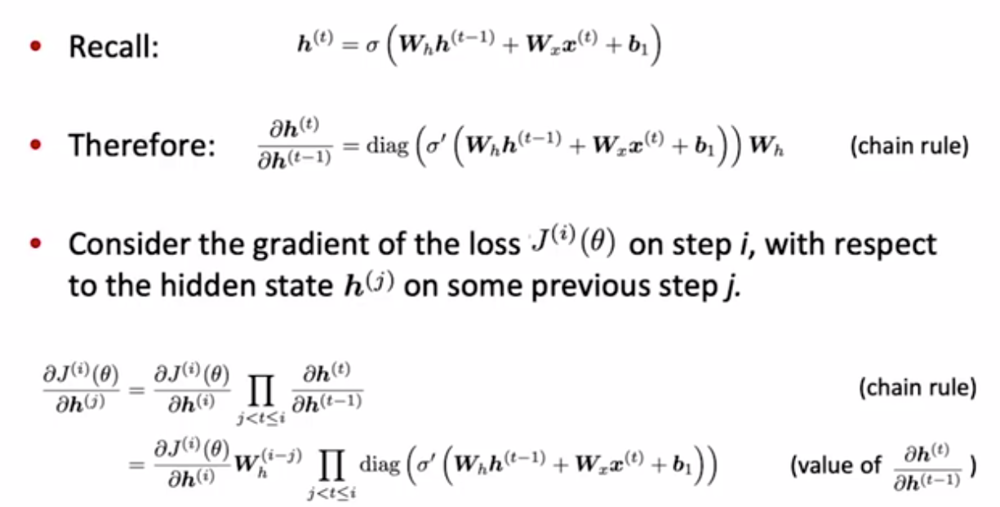

# 1.NLP和深度学习入门

- nlp：来自语言学，理解、表示语言。
- NLP层级：speech+phonetic/phonological analysis、text+OCR/tokenization->morphological analysis->syntactic analysis->semantic interpretation->discourse processing
- NLP应用：拼写检查、检索等、信息抽取、分类、机器翻译、对话系统、语音识别、词性标注、NER、句法分析。
- 深度学习：
  - 表征学习的分支
  - 人脑解码的时候是：连续的激活pattern
- NLP难点：
  - 歧义
  - 表示/学习/使用复杂
  - 强依赖于上下文。

# 2.词向量表示word2vec

- onehot表示：

  - 存在问题：向量过长，每个词都是正交的，没有近似含义，稀疏问题。

- wordnet：

  - 存在问题：这种分类词汇表示丢失大量细微的差别，缺失语义信息，不能计算语义相似度。

- 共现count向量表示：

  - 定义：和w2v一样，假设词汇周围出现的词汇和中心词汇意义相近，进行计数，形成矩阵
  - 问题：矩阵太大，常见停用词出现得太频繁了（稀有出现的词有更多的语义内容），新词加入还要重新统计所有文章。
  - 问题的解决：
    - SVD分解
    - 频繁词设定一个计数上限，超过上限按上限算  or  忽略频繁词
    - 乘以权重，靠近中心词的词出现次数权重大，边缘词出现次数权重小。

- 分布式表示：

- 分布式相似性：关于词汇语义的理论，通过词汇的上下文表示词汇。

- skip-gram：

  - 优缺点：速度慢，表现好。

  - 模型：$p(o|c)=\frac{exp(u_o^Tv_c)}{\sum_{w=1}^Vexp(u_w^Tv_c)}$

    - 整个模型有一个共享的概率分布。
    - u和v是独立的两个loookup表，不会互相耦合。
    - lookup表初始化：一个较小区间内均匀采样（实验得出）。

  - 损失：$J(\theta)=-log\prod_{t=1}^{T}\prod_{-m<=j<=m}P(w_{t+j}|w_t;\theta)=-\frac{1}{T}\sum_{t=1}^{T}\sum_{-m<=j<=m}logP(w_{t+j}|w_t;\theta)$

  - 算法：链式法则，推导

    

    

    

    

- CBOW：

- word2vec存在的问题：softmax的分母有一个求和运算，计算量特别大。

- word2vec问题的解决：
  - 对中心词和上下文词、中心词和非上下文词训练lr二分类。
  - negative sampling：
    - 公式：$J_t(\theta)=log\sigma(u_o^Tv_c)+\sum_{j\sim P(w)[log \sigma(-u^T_jv_c)]}，p(w)=\frac{U(w)^{\frac{3}{4}}}{Z}$
    - 一个细节：$1-\sigma(x)=\sigma(-x)$
    -  使用“一元模型分布(*unigram* *distribution*)”U(w)来选择“negative words” ，使得低频率词更容易被采集到
  
- word2vec物理意义：优化的过程词与词在不断聚类。

## 3.GloVe

- 优缺点：快速训练，能用于大规模语料，小规模语料上的表现也好。
- 损失函数： $J(\theta)=\frac{1}{2}\sum_{i,j=1}^{W}f(P_{ij})(u_i^Tv_j-logP_{ij})^2，P是共现count矩阵$
  - 意义：对于语料中的每对词我们希望最小化内积距离和、计数的log
  - 为什么u和v不是同一lookup表：两个相似参数空间的向量的内积表现会差、不稳定。
- 经验参数：300维词向量、window为8.
- 词向量评估：
  - 内在：
    - 方法举例：
      - 类比：a对于b等于c对于d。$d=arg max\frac{(x_b-x_a+x_c)^Tx_i}{||x_b-x_a+x_c||}$
    - 优缺点：计算快速，帮助理解系统（如：调参），not clear。
  - 外在：
    - 优缺点：对一个任务的真正评估，计算慢。

 # 4.word window分类与神经网络

- 如果训练集小，载入预训练词向量后就别训练词向量了，就训练分类的参数即可；反之词向量一起训练。
- window classification：
  - 使用方法：分类一个在某一特定上下文窗口中的词汇
  - W直接接softmax：模型是线性的，数据少的话正则效果好，数据多的话缺少泛化。
  - 模型：
    - 输入：center word和window word，concate到一起。
    - 隐藏层：3层神经元，sigmoid激活，最后softmax分类。
  - 损失函数：
    - 思想：最大间隔损失函数，中心词为正确词的窗口得分更高、中心词是错误词的窗口得分更低。这里把『足够好』定义为差值为1（别的也可以）。窗口的中心词是某类比窗口的中心词是非某类的score要+1。
    - 公式： $其中s_c是错误的分类样本得分，s是正确的样本得分，通过负采样得到负例。$
      - 朴素思想：最大化$s-s_c$
      - 只计算$s_c > s$时的错误：$max(s_c-s,0)$
      - 上述损失函数要求太低，风险太大了，要留出缓冲区域：$J=max(\delta-s+s_c)$
      - $J=max(0,1-s+s_c)$
    - 优缺点：比交叉熵更鲁邦，非常强大。
  - 算法：反向传播，推导

# 5.RNN和语言模型

- ngram模型：

  - 定义：n个连续词的集合。
  - 常见：unigram、bigram、trigram、4-gram
  - 核心思想：为了统计下个词的是什么，统计不同的ngram的频率。

- 语言模型

  - 作用：用于预测接下来的词是什么

  - 形式化定义：$P(x^{t+1}|x^t,...,x^1)$

  - 公式：$P(x^1,...,x^T)=P(x^1)*P(x^2|x^1)*...*P(x^T|x^{T-1},...,x^1)=\prod_{t=1}^T P(x^t|x^{t-1},...,x^1)$

  - 学习：学习一个ngram模型

  - 评估：困惑度越小越好，   $perplexity=\prod_{t=1}^T(P_{LM}(x^{t+1}|x^t,...,x^1))^{-\frac{1}{T}}=\prod_{t=1}^T(\hat y_{x_{t+1}}^t)^{-\frac{1}{T}}=exp(-\frac{1}{T}\sum_{t=1}^Tlog\hat y_{x_{t+1}}^t)=exp(CE(\theta))，T为词的数目$

  - ngram语言模型：

    - 假设：$x_t$只和最近的n-1个词有关，计数即可。
    - 公式：分母是n-1=gram的概率，分子是ngram概率$P(x^{t+1}|x^t,...,x^1)=\frac{P(x^{t+1},x^t,...,x^{t-n+2})}{P(x^t,...,x^{t-n+2})}$
    - 稀疏性问题：计数为0。通常不用大于5gram，防止稀疏性。
      - 分子：平滑来解决，加一个小的数。
      - 分母：ngram问题退回到n-1gram模型

  - word window语言模型：

    - 结构

    

    - 优缺点：
      - 没有ngram这种基于统计的方法稀疏问题大
      - 不用存储所有观察到的ngram计数
      - window可能太小，丢失远处依赖
      - 在权重矩阵中学习的每个term对应的W不与其他term对应的W共享

    

- RNN：

  - 隐状态初始化：可以学习初始化，也可以是零向量。

  - 模型：

    - $h^t=sigmoid(W_1x_t+W_2h_{t-1}+b)$
    - $\hat{y}=softmax(Uh^t+b)$，隐状态算出来后接一个线性层softmax or sigmoid，不加入别的非线性。

  - 损失函数：每个输出的Loss（如交叉熵）加和。

  - 算法：梯度。

    

  - 优缺点：

    - 能处理任何长度的文本
    - 能使用很多之前时间点的特征
    - 模型大小不会随着输入的长度变长而变大
    - 每个时间点都有相同的权重
    - 计算缓慢，由于要依赖t-1步隐状态，计算不能高度并行
    - 梯度消失、梯度爆炸。原理：考虑矩阵的L2范数如下，当$w_h$的特征值小于1，梯度$||\frac{\partial J^i(\theta)}{\partial h^j}||$会消失，反之会爆炸。远离损失的梯度会消失。在每一步中，隐状态都被重写了，没有保留。

    

  - 梯度爆炸的解决：梯度裁剪，如果梯度的范数比某个阈值大，则手动裁剪。

  - 梯度消失的解决：LSTM

- LSTM：

  - 模型：
  - 优缺点：
    - 细胞状态保存长期的信息，LSTM细胞状态可以擦除、重写、读取信息。
    - 不能保证解决长短时依赖问题。

- GRU：

  - 模型：
  - 优缺点：简单
  - LSTM vs GRU：
    - GRU更简单、参数更少、计算更快
    - 两者性能不分上下，根据不同业务背景选
    - 通常LSTM是个默认选择：特别是数据有长时依赖  or  训练数据很多的时候
    - 对性能有更高要求的时候转而用GRU

- 双向RNN：

  - motivation：过马路要两边看（结合例子文本情绪分类）
  - 模型：
  - 优缺点：建模更完善，不能用于语言模型（不知道下一个词是什么，只能单向建模）

- 多层RNN：

  - motivation：deep更好，允许网络计算更复杂的表示。
  - 模型：
  - 一般2-4层表现就很好了
  - 优缺点：无法并行计算，计算成本高。

# 6.依赖分析

- 语言结构：
  - 短语结构（constituency=phrase structure grammar=context-free grammars(CFGs)）：word组成phrase，phrase组成sentense，嵌套结构
  - 依赖结构（dependency structure）：词与词之间修饰、依赖。不同修饰方法。

