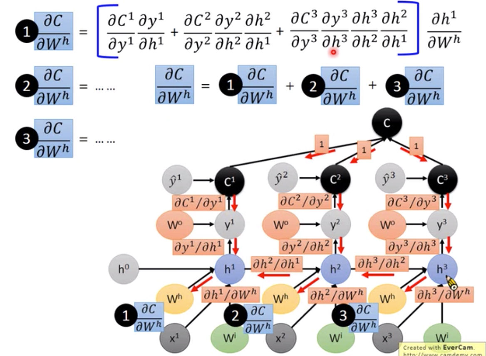

# 1.基础网络结构

## 1.1FC

## 1.2rnn

- why梯度消失：

  

- deep rnn

- bidirectional-rnn

  

- Pyramidal rnn

  

- lstm：实验表明，重要性forget>input>output，给forget gate 一个大的bais对结果有帮助。

- gru

  

- stack rnn

  

## 1.3Convolutional/pooling layer

- 图示：

- TD：

  - 稀疏连接：区别于fc的全连接，每个神经元只和前一层的某部分连接。
  - 参数共享：不同感受野的神经元可以有相同参数，共享的神经元记作同个kernel，神经元的感受野尺寸叫做kernel size。

- 参考：https://zhuanlan.zhihu.com/p/42090228

- 通道数计算：卷积核输入维度=输出通道数，卷积核个数1=输入通道数，kernel与数据在卷积核输入维度方向分别卷积，之后将卷积后的数值相加。fielter是kernel的集合，每个通道对应一个卷积核，每个filter只有一个输出通道。

  

- 输出尺寸计算：

  

- zero padding：full、same、valid。

- Pooling：$L_k$ pooling，做group操作。

# 2.链式法则

- 流程：

  - 画出计算图
  - 前向求解各个节点值
  - 后向算出计算图上每个连线的微分
  - 将各个节点的值带入微分公式，再加起来and乘起来。

- 向量对向量求导：

  

- softmax输出对逻辑层数值求导得到的求导矩阵不是对角的，sigmoid输出对逻辑层数值求导得到的求导矩阵是对角的。

- 例子：

  - 依赖、关联情况：求偏微分$e=(a+b) * (b+1)$：有依赖的都用加法、乘法关联起来。

    $\frac{\partial e}{\partial b}=\frac{\partial e}{\partial c}*\frac{\partial c}{\partial b}+\frac{\partial e}{\partial d} \frac{\partial d}{\partial b}=1*(b+1)+1*(a+b)$

  - 参数共享情况：求偏微分$y=xe^{x^2}$，把三个x当做不同值（x1、x2、x3）看。

    $\frac{\partial y}{\partial x}=e^{x^2}+2xxe^{x^2} $

  

# 3.激活函数

## 3.1Sigmoid

- 公式：
  - 原始
  - 导数
- 图像：
  - 原始
  - 导数
- 优缺点：
  - 梯度消失
  - Sigmoid 函数的输出映射在(0,1)之间，单调连续，输出范围有限，优化稳定，可以用作输出层。它在物理意义上最为接近生物神经元。
  - 输出不是以0为中心的。
  - 计算量大。

## 3.2tanh

- 公式
  - 原始
  - 导数
- 图像
  - 原始
  - 导数
- 优缺点
  - 梯度消失
  - Tanh 网络的收敛速度要比 Sigmoid 快。因为 Tanh 的输出均值比 Sigmoid 更接近 0，SGD 会更接近 natural gradient（一种二次优化技术），从而降低所需的迭代次数。
  - 相比Sigmoid函数，其输出以0为中心。
  - 计算量大

## 3.3ReLU

- 公式
  - 原始
  - 导数
- 图像：
  - 原始
  - 导数
- 优缺点：
  - 缓解了梯度消失
  - 相比起Sigmoid和tanh，ReLU在SGD中能够快速收敛。据称，这是因为它线性、非饱和的形式。
  - 随着训练的进行，可能会出现神经元死亡，权重无法更新的情况。如果发生这种情况，那么流经神经元的梯度从这一点开始将永远是0。也就是说，ReLU神经元在训练中不可逆地死亡了。
  - 计算量小
  - 提供了神经网络的稀疏表达能力。相关大脑方面的研究表明生物神经元的信息编码通常是比较分散及稀疏的。通常情况下，大脑中在同一时间大概只有1%-4%的神经元处于活跃状态。使用线性修正以及正则化（regularization）可以对机器神经网络中神经元的活跃度（即输出为正值）进行调试。

## 3.4Leaky ReLU&PReLU

- 公式：PReLU的ai是跟随数据变化的，LeakyReLU的ai是固定的超参。
- 图像
- 优缺点：

## 3.5Maxout

# 4.BatchNormal

- motivation：

  - internal covariate shift问题：

    - 网络训练过程中前几层参数不断改变导致后续每一层输入的分布也发生变化，而学习的过程又要使每一层适应输入的分布，每层的scale不一样，每层需要的学习率是不一样的，因此我们不得不降低学习率、小心地初始化。用bn的话，能加速训练。使得初始化的影响更小：同大同小不影响。
    - 如下所示，左侧的在优化时不容易，两个方向lr差的太大了（可以设置小的lr来解决，但是这样训练太慢了），需要feature scaling。保证每个layer的统计值一样。

    

  - 解决梯度消失：见https://www.zhihu.com/question/38102762/answer/391649040

  - 对抗过拟合：https://www.zhihu.com/question/275788133/answer/386514307

- 一般先做bn，再做activation。bn不能用于小batch（bn本意是想计算所有样本的均值、标准差）。这样做在训练初期，分界面还在剧烈变化时，计算出的参数不稳定，所以退而求其次，在仿射变换之后进行归一化。

- 像卷积层这样具有权值共享的层，Wx+b的均值和方差是对整张map求得的，在batch_size * channel * height * width这么大的一层中，对总共batch_size * height * width个像素点统计得到一个均值和一个标准差，共得到channel组参数。

- 不适用场景：

  - batch特别小
  - rnn：因为它是一个动态的网络结构，同一个batch中训练实例有长有短，导致每一个时间步长必须维持各自的统计量，这使得BN并不能正确的使用。

- train正向传播：

  - 注意这里标准差使用的期望是其无偏估计，即m/m-1
  - 所有batch的数据共享一个\gamma$和$\beta$
  - $\mu$和$\sigma$是由数据决定的，用于将数据归一化，$\gamma$和$\beta$是网络参数，用于缩放和平移，两者还是有区别。
  - why用$\gamma$和$\sigma$：
    - 对sigmoid来说，如果不用$\gamma$和$\sigma$的话，输出数据在[0,1]之间，相当于后一层的激活层就只使用了[0,1]部分（sigmoid函数的话就近似线性），使得模型表达能力差。
    - 对于ReLU来说，gamma的作用可能不是很明显，因为relu是分段”线性“的，对数值进行伸缩并不能影响relu取x还是取0。但beta的作用就很大了，试想一下如果没有beta，经过batch normalization层的特征，都具有0均值的期望，这样岂不是强制令ReLU的输出有一半是0一半非0么？这与我们的初衷不太相符，我们希望神经网络自行决定在什么位置去设定这个阈值，而不是增加一个如此强的限制。
    - 缩放和平移即可以保持原输入又可以改变原输入，使得模型容量提升。这样的目的也是为了补偿网络的非线性表达能力，因为经过标准化之后，偏移量丢失。

  

- Train反向传播：注意$\mu$和$\sigma$是函数，不是一个常数。

- test正向传播：$\mu$和$\sigma$未知，这怎么办呢？

  - 方法1：使用所有training set的数据来计算均值、方差——计算复杂度高，要过一遍所有数据
  - 方法2：过去梯度更新过程中每个batch的均值、方差保存，加权求和，training结束的时候的batch的均值、方差权重更大。

# 5.Dropout

# 6.初始化方法

# 7.梯度消失、爆炸

# 8.优化方法

## 8.1SGD：

- 定义：梯度下降的batch版本，每次更新利用一个batch的数据。
- 优缺点：
  - 减少机器压力
  - 训练数据有很多冗余的时候（如类似的样本出现多次），尽快收敛。以一个极端情况为例，若训练集前一半和后一半梯度相同。那么如果前一半作为一个batch，后一半作为另一个batch，那么在一次遍历训练集时，batch的方法向最优解前进两个step，而整体的方法只前进一个step。
  - 更新方向完全依赖于当前的batch，因而其更新十分不稳定。

## 8.2Momentum

- 定义：$\partial x_t=\rho \partial x_{t-1} -\eta g_t$。
- 符号：
  - ρ 即momentum，表示要在多大程度上保留原来的更新方向，这个值在0-1之间，在训练开始时，由于梯度可能会很大，所以初始值一般选为0.5；当梯度不那么大时，改为0.9。
  - η 是学习率，即当前batch的梯度多大程度上影响最终更新方向，跟普通的SGD含义相同。ρ 与 η 之和不一定为1。

## 8.3Nesterov Momentum

- 定义：$\partial x_t=\rho \partial x_{t-1} -\eta \partial f(x_t+\rho \partial x_{t-1})$。

  - 首先，按照原来的更新方向更新一步（棕色线）
  - 然后在该位置计算梯度值（红色线）
  - 然后用这个梯度值修正最终的更新方向（绿色线）。

- 图示：

  

## 8.4Adagrad

- Motivation：不同的变量应该有不同的学习率。学习率应该衰减。

- 定义：ϵ是为了维持数值稳定性而添加的常数，如10−6，$g^t$是当前batch的梯度。这里开方、除法和乘法的运算都是按元素运算的。这些按元素运算使得目标函数自变量中每个元素都分别拥有自己的学习率。

  $\boldsymbol{s}_t \leftarrow \boldsymbol{s}_{t-1} + \boldsymbol{g}_t \odot \boldsymbol{g}_t$

  $\boldsymbol{x}_t \leftarrow \boldsymbol{x}_{t-1} - \frac{\eta}{\sqrt{\boldsymbol{s}_t + \epsilon}} \odot \boldsymbol{g}_t,$

- TD：

  - 前期$g_t$较小的时候， lr较大，能够放大梯度
  - 后期$g_t$较大的时候，lr较小，能够约束梯度
  - 适合处理稀疏梯度

- 优缺点：

  - 依赖于人工设置一个全局学习率$\eta$
  - 由于$s_t$一直在累加按元素平方的梯度，自变量中每个元素的学习率在迭代过程中一直在降低（或不变）。所以，当学习率在迭代早期降得较快且当前解依然不佳时，AdaGrad算法在迭代后期由于学习率过小，可能较难找到一个有用的解，导致训练提前结束。

## 8.5RMSprop

- 定义：$s_t$开始为0。

  $\boldsymbol{s}_t \leftarrow \gamma \boldsymbol{s}_{t-1} + (1 - \gamma) \boldsymbol{g}_t \odot \boldsymbol{g}_t$

  $\boldsymbol{x}_t \leftarrow \boldsymbol{x}_{t-1} - \frac{\eta}{\sqrt{\boldsymbol{s}_t + \epsilon}} \odot \boldsymbol{g}_t$

## 8.6Adadelta

- 定义：$\Delta x_t$和$s_t$开始都为0。

  $\boldsymbol{s}_t \leftarrow \rho \boldsymbol{s}_{t-1} + (1 - \rho) \boldsymbol{g}_t \odot \boldsymbol{g}_t$

  $\boldsymbol{g}_t' \leftarrow \sqrt{\frac{\Delta\boldsymbol{x}_{t-1} + \epsilon}{\boldsymbol{s}_t + \epsilon}}   \odot \boldsymbol{g}_t$

  $\Delta\boldsymbol{x}_t \leftarrow \rho \Delta\boldsymbol{x}_{t-1} + (1 - \rho) \boldsymbol{g}'_t \odot \boldsymbol{g}'_t$

  $\boldsymbol{x}_t \leftarrow \boldsymbol{x}_{t-1} - \boldsymbol{g}'_t$

## 8.7Adam

- 定义：0≤β1<1（算法作者建议设为0.9），0≤β2<1（算法作者建议设为0.999）。

  $\boldsymbol{v}_t \leftarrow \beta_1 \boldsymbol{v}_{t-1} + (1 - \beta_1) \boldsymbol{g}_t$

  $\boldsymbol{s}_t \leftarrow \beta_2 \boldsymbol{s}_{t-1} + (1 - \beta_2) \boldsymbol{g}_t \odot \boldsymbol{g}_t$

  $\hat{\boldsymbol{v}}_t \leftarrow \frac{\boldsymbol{v}_t}{1 - \beta^t_1}$

  $\hat{\boldsymbol{s}}_t \leftarrow \frac{\boldsymbol{s}_t}{1 - \beta^t_2}$

  $\boldsymbol{g}_t' \leftarrow \frac{\eta \hat{\boldsymbol{v}}_t}{\sqrt{\hat{\boldsymbol{s}}_t} + \epsilon}$

  $\boldsymbol{x}_t \leftarrow \boldsymbol{x}_{t-1} - \boldsymbol{g}_t'.$

# 9.损失函数

# 10.调优技巧

- training data效果差：
  - 选择合适loss
  - 看mini batch_size的loss：更快、更精确
  - 新激活函数
  - lr修改：逐渐减少lr
- test data效果差：
  - early stopping
  - regularization
  - dropout
  - 模型结构